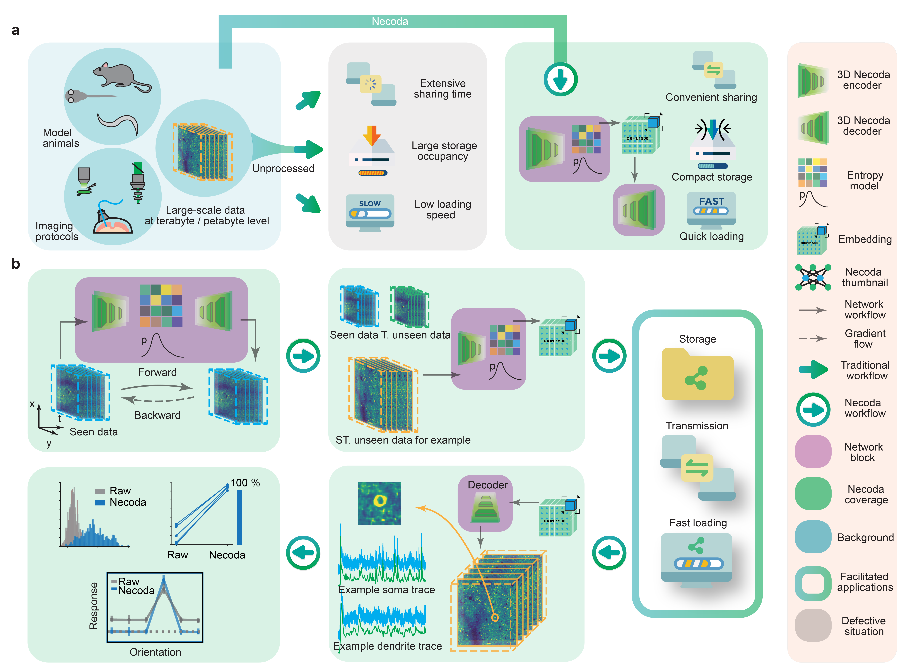
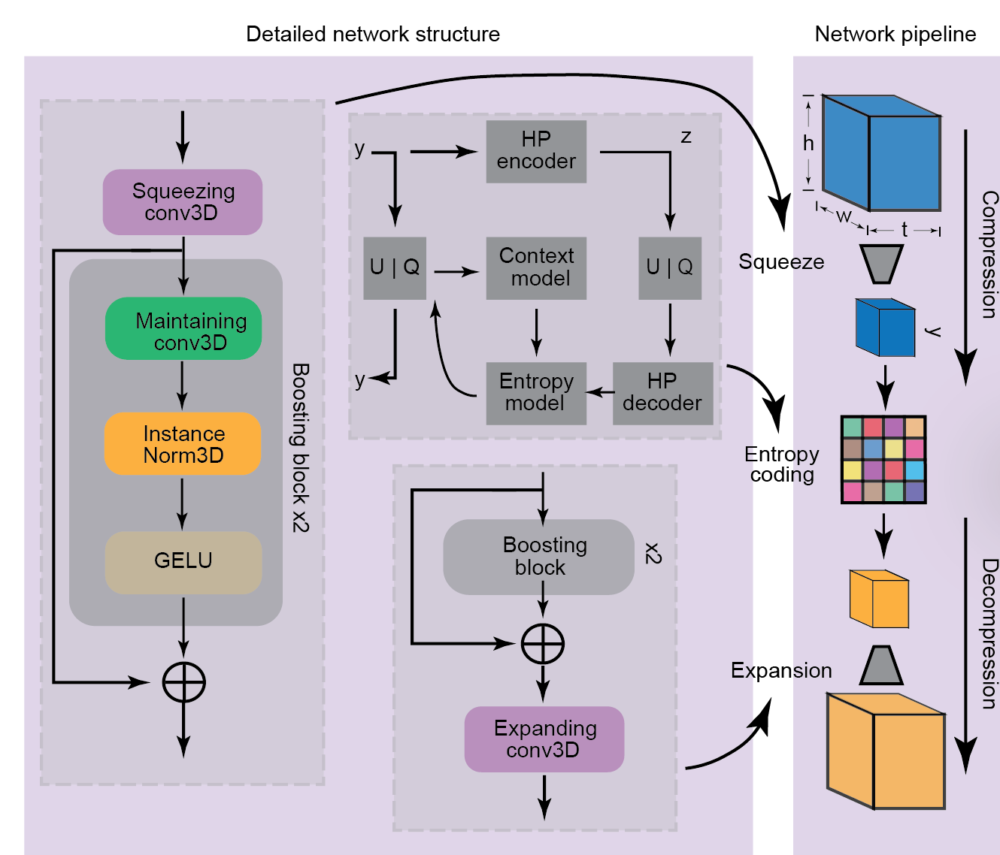
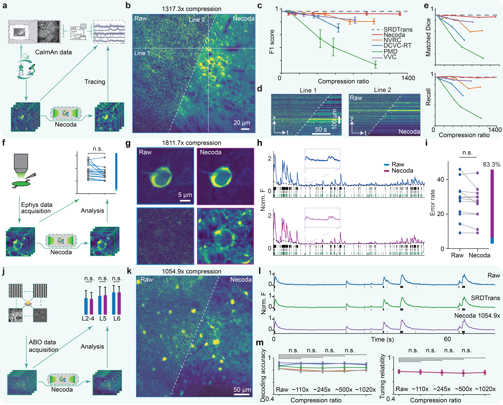
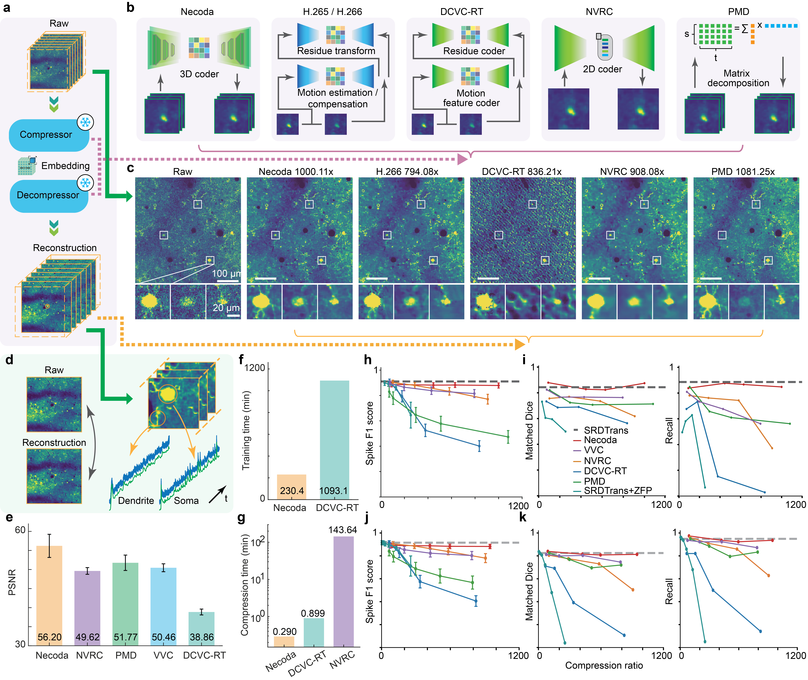
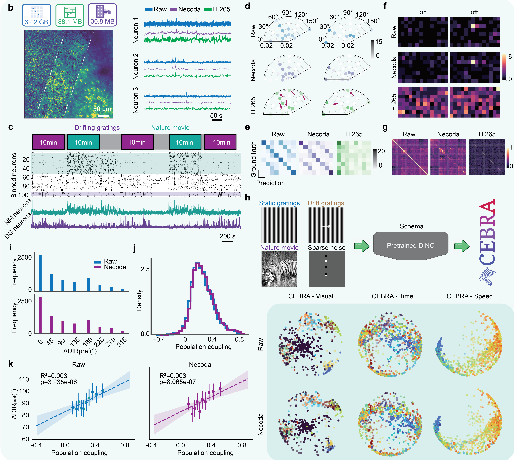

# Necoda: High-Fidelity Functional Neural Data Compression via Neural Representation Enhances Data Sharing



## [Project page](https://tsuxinh.github.io/Necoda/)

## Contents

- [Overview](#overview)
- [Directory structure](#directory-structure)
- [Pytorch code](#pytorch-code)
- [Results](#results)
- [Citation](#citation)

## Overview



In neuroscience, progress hinges on sharing large-scale data. Sharing comprehensive, raw-like imaging data is particularly crucial for transparency, reproducibility, and developing new analysis tools.

The primary obstacle is data size. Functional imaging datasets often reach the terabyte-scale, creating a massive bottleneck for data sharing, storage, and reuse. These logistical hurdles severely slow the pace of discovery and hinder the reproduction of scientific findings.


To solve this, we developed **Necoda, a deep learning method that compresses functional imaging data by over 1,000-fold while maintaining high fidelity**. Our method uses a content-adaptive encoder-decoder network that leverages the inherent spatiotemporal structure of neural recordings. A key innovation is Necoda's ability to generalize across unseen data; we can train it once on a small data subset and then apply it to compress numerous other experiments, making it a practical and efficient tool.

We demonstrated that **Necoda preserves essential scientific information while drastically reducing file size**. We validated our method on diverse datasets, including data from different species, brain regions, and imaging modalities. In our key proof-of-concept, we compressed a 4.82 TB ABO dataset to just 4.81 GB. Using only this compact file, we fully reproduced the published findings of a major neuroscience study in just a few hours. 

By removing the data-sharing bottleneck, we believe Necoda will significantly accelerate discovery and enhance reproducibility in neuroscience.

## Directory structure

## Pytorch code 

### Environment 

* Ubuntu 20.04
* Python 3.10.14
* Pytorch 2.2.1
* NVIDIA GPU (24 GB Memory) + CUDA

### Code setup


* Create a virtual environment and install Pytorch. Please select the correct Pytorch version that matches your CUDA version at https://pytorch.org/get-started/previous-versions/

```
$ conda create -n necoda python=3.10
$ source activate necoda
$ pip install torch==2.2.1 torchvision==0.17.1 torchaudio==2.2.1 --index-url https://download.pytorch.org/whl/cu121
```

* Clone the environment here.

```
$ git clone git@github.com:TSuXinH/Necoda.git
$ cd Necoda
```

* Install other necessary dependencies

```
$ pip install -r requirements.txt
```


### Training

For the dataset with a spatial shape of 512x512 and temporal shape of 6000, the following command can be used for standard training setup. This will generate quant.pth that can be further compressed via well-developed techniques like 7z. The detailed meaning of each argument can be found in the training script.

To speed up training, `traing_3stage.py` can be used to enable hierarchical training strategy.
```
CUDA_VISIBLE_DEVICES=0 python train_huff.py --pre_norm mean_std --output_path {} --data_path {} \
                    --act gelu --norm none --pre_s_rate 2 --pre_t_rate 2 --s_emb_dim 2 --t_emb_dim 2 \
                    --s_s_rate_list 1 1 1 --t_s_rate_list 4 4 4 --s_t_rate_list 4 4 4 --t_t_rate_list 1 1 1 \
                    --loss L2 --model_type nerp_st -e 100 --eval_freq 10 -b 2 --lr 2e-4 --overwrite \
                    --chns_list 32 32 32 -g {} --quant_embed_bit 4 --remark interp8 --interp_size_x 8 --interp_size_t 8
``` 

### Inference
The following command can be used to decompress the compressed latents with the trained network to obtain the reconstruction.
```
CUDA_VISIBLE_DEVICES=0 python recon_nerp_st_huff.py -d {} -e {} --name recon_{} -g {}
```


## Results

### 1. Performance of Necoda across diverse imaging modalities.
Evaluation of Necoda on multiple functional imaging datasets reveals that Necoda effectively compresses neuroimaging collections while preserving necessasry physiological information.



### 2. Benchmarking Necoda with existing video codecs.
Necoda outperforms other codecs in training/compression efficiency and rate distortion performance on simulation benchmarks.



### 3. Reproducing analysis with Necoda on ABO datasets.
Reproduction of results from one previous research paper with ABO datasets demonstrates that Necoda is able to function as a tool to facilitate TB-level data sharing and replication.




## Citation

Currently paper of this project is not officially online.

